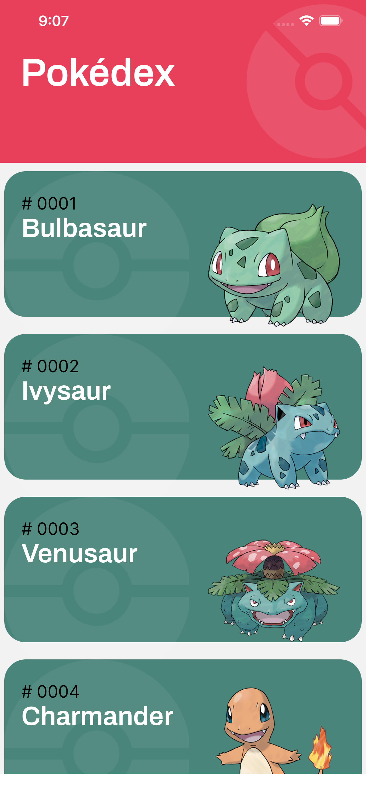

<h1 align="center">
    
</h1>

  
  

# Desafio
Pokédex.

## Requisitos:
- Criar uma tela inicial listando todos os pokémons 
- Ao clicar em um personagem, o usuário será redirecionado para o perfil do mesmo, onde conterá mais informações como dados de treinamento, indicadores, tipos de defesa.
- Criar teste unitário.

# Techs: 
- React Native.

## Dados:
https://pokeapi.co/
